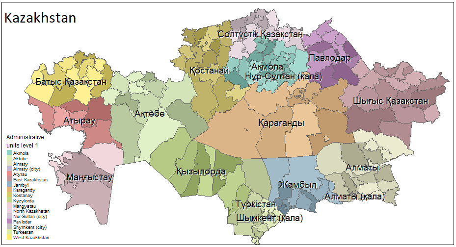

# geokz    

This project downloads a set of shapefiles relevant to the Republic of Kazakhstan. 



`geokz`-package provides access to multiple dataset of different types and for different use. 

## Package installation

`geokz` can be installed from Github using:

`library("devtools")`

`devtools::install_github("arodionoff/geokz")`

Vignette [*Making maps using {geokz}-package*](https://rpubs.com/A_Rodionoff/geokz) provides multiple real-world examples of their usage.

To use vignettes, you should use the installation with vignettes compilation: `devtools::install_github("arodionoff/geokz", build_vignettes = TRUE)`.

In these vignettes we introduce the different datasets and explain their use cases. 

## The following spatial objects are included:  

**administrative:**

* **kaz_adm0_sf**: Administrative units level 0 - the [boundary of Kazakhstan](inst/shape/kaz_admbnda_adm0_2018.shp).
* **kaz_adm1_sf**: Administrative units level 1 - the [boundaries of Regions](inst/shape/kaz_admbnda_adm1_2018.shp) (the Capital, Oblasts and Cities of Republican Significance).
* **kaz_adm2_sf**: Administrative units level 2 - the [boundaries of Districts](inst/shape/kaz_admbnda_adm2_2018.shp) (Oblast Rayons, City of Oblast Significance and Rayons of Cities of Republican Significance)
* **kaz_cnt1_sf**: All Administrative [Centers](inst/shape/kaz_admbnda_cnt1_2019.shp) level 1 of Kazakhstan including the Capital, Cities of Republican Significance and all center of Oblasts.

**natural:**

* **natural_zones**: the list of Administrative units level 2 of Kazakhstan by Zones according to the natural conditions.

You can use ESRI ArcGIS shapefiles (\*.cpg, \*.dbf, \*.prj, \*.shp, \*.shx) load as [`shape`](inst/shape) subdirectory.

## Using with **Python**

If necessary, a similar operations can be performed in **Python**.

If the required packages are not available, then they should be installed in the required ``Python`` instance. **{GeoPandas}** depends on the following packages:

* ``pandas`` - operations with dataframe.
* ``shapely`` - analysis and manipulation of geometry features.
* ``fiona`` -  read and write dataframe using multi-layered GIS formats.
* ``pyproj`` - Python interface to PROJ (cartographic projections and coordinate transformations library).

``fiona``, in turn, depends on ``attrs``, ``click``, ``cliji``, ``click_plugins``, ``munch`` and, of couse, ``GDAL`` packages.

* ``matlabplot`` - a comprehensive library for creating static, animated, and interactive visualizations in Python.

```
import sys
print(f'\nPython Ver. =  {sys.version}')

# importing necessary libraries
import pandas as pd
import geopandas as gpd

gpd.show_versions()

kaz_ADM1_gdf = gpd.read_file('C:/R/R-4.1/library/geokz/shape/kaz_admbnda_adm1_2018.shp',
                             driver = 'ESRI Shapefile', encoding = 'utf-8')

kaz_ADM1_gdf.crs
print(kaz_ADM1_gdf)

import matplotlib.pyplot as plt
import matplotlib.patches as patches

# Set Number Code for Regions and Customer Legend
kaz_ADM1_gdf.loc[(kaz_ADM1_gdf['ADM1_PCODE'] == 'KZ11') | 
                 (kaz_ADM1_gdf['ADM1_PCODE'] == 'KZ39') |
                 (kaz_ADM1_gdf['ADM1_PCODE'] == 'KZ55') |
                 (kaz_ADM1_gdf['ADM1_PCODE'] == 'KZ59') |
                 (kaz_ADM1_gdf['ADM1_PCODE'] == 'KZ71'), 'Regions'] = 0  # 'North'
kaz_ADM1_gdf.loc[(kaz_ADM1_gdf['ADM1_PCODE'] == 'KZ15') | 
                 (kaz_ADM1_gdf['ADM1_PCODE'] == 'KZ23') |
                 (kaz_ADM1_gdf['ADM1_PCODE'] == 'KZ27') |
                 (kaz_ADM1_gdf['ADM1_PCODE'] == 'KZ47'), 'Regions'] = 1  # 'West'
kaz_ADM1_gdf.loc[kaz_ADM1_gdf['ADM1_PCODE'] == 'KZ35', 'Regions']   = 2  # 'Center'
kaz_ADM1_gdf.loc[kaz_ADM1_gdf['ADM1_PCODE'] == 'KZ63', 'Regions']   = 3  # 'East'
kaz_ADM1_gdf.loc[(kaz_ADM1_gdf['ADM1_PCODE'] == 'KZ19') | 
                 (kaz_ADM1_gdf['ADM1_PCODE'] == 'KZ31') |
                 (kaz_ADM1_gdf['ADM1_PCODE'] == 'KZ43') |
                 (kaz_ADM1_gdf['ADM1_PCODE'] == 'KZ61') |
                 (kaz_ADM1_gdf['ADM1_PCODE'] == 'KZ75') |
                 (kaz_ADM1_gdf['ADM1_PCODE'] == 'KZ79'), 'Regions'] = 4  # 'South'

#Re-Projection
kaz_ADM1_gdf = kaz_ADM1_gdf.to_crs(epsg = 2502)  # Pulkovo 1942 / Gauss-Kruger CM 69E. See <https://epsg.io/2502>
kaz_ADM1_gdf.crs

# Create color dictionaries for Regions- Set colors for Customer Palette in R: tmaptools::get_brewer_pal("Set3", n = 5)
palette_symb = {0: '#8DD3c7', 1: '#FFFFB3', 2: '#BEBADA', 3: '#FB8072', 4: '#80B1D3'}
regions_symb={0: 'North', 1: 'West', 2: 'Center', 3: 'East', 4: 'South'}

# Plot Geographic Coverage
fig, ax = plt.subplots(figsize=(7, 4))

kaz_ADM1_gdf.plot(
  color = kaz_ADM1_gdf['Regions'].map(palette_symb),
  edgecolor = 'black',
  linewidth = 0.15,
  categorical = True,
  legend = False,
  ax = ax
  )

kaz_ADM1_gdf.apply(lambda x: ax.annotate(text=x.ADM1_EN, xy=x.geometry.centroid.coords[0], ha='center', size=9), axis=1)

# Create Customer Legend for Category Legend
legend_elements = []
for x in range(len(regions_symb)):
    legend_elements.append(patches.Patch(facecolor=palette_symb[x],
                                         edgecolor='black',
                                         label=regions_symb[x]))
    
ax.legend(handles=legend_elements, bbox_to_anchor=(1.1, 1.1), title='Regions', prop={'size': 9})
ax.set(title = 'Regions of Kazakhstan')
ax.set_axis_off()

plt.show()

```

## A call for action

The project is actively maintained, and ideas & suggestions to improve the package are greatly welcome. Should you feel more at ease with old fashioned email than the GitHub ticketing system - do drop me a line.
